# AWS Accounting AI ERD (Current Build)

This ERD documents the current persistence layers used by the Accounting AI service in AWS.

Scope:
- Primary relational database: AWS RDS PostgreSQL (Django ORM tables)
- State/checkpoint stores: DynamoDB
- Object persistence: S3 (document and artifact domains)

Important note:
- This file reflects the **current deployed AI-service schema**.
- Recommended backend-alignment bridge fields are documented separately and are **not** drawn into the live ERD unless they exist in code and migrations.

## 1. Persistence Topology

- RDS PostgreSQL:
  - System of record for OCR, enrichment, chat, feedback, export tracking, GL persistence, and audit logs.
- DynamoDB:
  - LangGraph checkpointing table for interrupt/resume state.
  - Episodes table in the hybrid pipeline stack.
- S3:
  - Raw and processed OCR artifacts, organized supplier copies, and uploaded GL workbooks.

## 2. Logical ERD (RDS)

```mermaid
erDiagram
    DOCUMENTS ||--|| OCR_RESULTS : has_one
    DOCUMENTS ||--o{ PARSED_FIELDS : has_many

    CHAT_CHATSESSION ||--o{ CHAT_CHATMESSAGE : has_many
    CHAT_CHATSESSION ||--o{ CHAT_JOBCALLBACK : resumes_from

    SESSIONS_SESSION ||--o{ SESSIONS_SESSIONMESSAGE : has_many

    DOCUMENTS ||--o{ CONFIRMED_DOCUMENTS : confirms
    DOCUMENTS ||--o{ FIELD_FEEDBACK : reviewed_by
    DOCUMENTS ||--o{ CATEGORISATION_RESULTS : categorised_as
    DOCUMENTS ||--o{ SUMMARY_RESULTS : summarized_as

    TENANT_CHART_OF_ACCOUNTS ||--o{ TENANT_CATEGORISATION_RULES : assigned_account
    TENANT_CHART_OF_ACCOUNTS ||--o{ HISTORICAL_MAPPINGS : final_account
    TENANT_CHART_OF_ACCOUNTS ||--o{ CATEGORISATION_RESULTS : chosen_account

    CHAT_FEEDBACKSUBMISSION ||--o{ FIELD_FEEDBACK : contains
    CHAT_FEEDBACKSUBMISSION ||--o{ EXTRACTION_RULES : proposes

    GL_JOURNAL_ENTRIES ||--o{ GL_JOURNAL_LINES : has_lines
    CONFIRMED_DOCUMENTS ||--o{ AUTOCOUNT_EXPORT_ITEMS : exported_as
    AUTOCOUNT_EXPORT_BATCHES ||--o{ AUTOCOUNT_EXPORT_ITEMS : contains

    CHAT_CHATSESSION {
      string session_id UK
      string tenant_id
      string user_id
      int fiscal_year
      string active_doc_id
      string title
      string status
      bool is_active
      datetime created_at
      datetime updated_at
    }

    CHAT_CHATMESSAGE {
      int id PK
      int session_id FK
      string role
      text content
      json metadata
      datetime created_at
    }

    CHAT_JOBCALLBACK {
      int id PK
      string doc_id
      string tenant_id
      string job_status
      text ocr_json_key
      string session_id
      string status
      text error
      datetime received_at
      datetime processed_at
    }

    CHAT_EXPENSERECORD {
      int id PK
      string tenant_id
      string user_id
      int fiscal_year
      date expense_date
      int month
      decimal amount
      string currency
      string category
      string vendor
      text description
      string reference_number
      string gl_account_code
      string gl_account_name
      string doc_id
      string journal_id
      datetime recorded_at
    }

    CHAT_FEEDBACKSUBMISSION {
      int id PK
      string feedback_id UK
      string tenant_id
      string doc_id
      string session_id
      string status
      json original_extraction
      json corrected_extraction
      json corrections
      json corrections_summary
      json rules_generated
      text reprocess_execution_arn
      datetime created_at
      datetime updated_at
    }

    CHAT_TENANTLLMUSAGE {
      int id PK
      string tenant_id
      string period
      int total_requests
      int total_tokens
      decimal total_cost_usd
      int max_requests_per_month
      decimal max_cost_usd_per_month
      int max_tokens_per_month
      datetime created_at
      datetime updated_at
    }

    OCR_OCRJOB {
      int id PK
      string tenant_id
      string doc_id
      string status
      text raw_key
      text stage_key
      text validated_key
      json extracted_fields
      datetime created_at
      datetime updated_at
    }

    DOCUMENTS {
      int id PK
      string doc_id UK
      string tenant_id
      string filename
      string content_type
      int file_size
      string upload_source
      string status
      text s3_raw_key
      datetime created_at
      datetime updated_at
    }

    OCR_RESULTS {
      int id PK
      string doc_id FK
      text raw_text
      json layout_blocks
      json tables
      float ocr_confidence
      string ocr_model
      int page_count
      datetime created_at
    }

    PARSED_FIELDS {
      int id PK
      string doc_id FK
      string tenant_id
      string field_name
      text value
      float confidence
      string source
      string validation_status
      text validation_message
      datetime created_at
    }

    POSTING_GLPOSTINGENTRY {
      int id PK
      string entry_id UK
      string tenant_id
      string session_id
      string reference_number
      string supplier_id
      string supplier_name
      string account_code
      float amount
      string status
      json metadata
      datetime posted_at
      datetime created_at
    }

    POSTING_USERGLPROFILE {
      int id PK
      string tenant_id
      string user_id
      int fiscal_year
      text gl_file_path
      int accounts_count
      datetime initialised_at
      datetime updated_at
    }

    CORE_AUDITLOG {
      int id PK
      string request_id UK
      string tenant_id
      string user_id
      string method
      string path
      string query_params
      int status_code
      float duration_ms
      string ip_address
      string user_agent
      int content_length
      datetime timestamp
    }

    TENANT_KNOWLEDGE {
      int id PK
      string tenant_id UK
      json merchant_mappings
      json category_rules
      json category_statistics
      decimal avg_invoice_amount
      json common_gl_accounts
      json custom_terminology
      int learning_episode_count
      datetime created_at
      datetime updated_at
    }

    GOLDEN_EXAMPLES {
      int id PK
      string example_id UK
      string tenant_id
      string domain
      text input_text
      json output_classification
      json embedding
      float quality_score
      int usage_count
      float success_rate
      datetime created_at
      datetime last_used_at
    }

    USER_PROFILES {
      int id PK
      string tenant_id
      string user_id
      json preferred_categories
      json common_vendors
      json typical_expense_ranges
      string communication_style
      json preferred_gl_accounts
      json custom_category_rules
      json upload_patterns
      json correction_history
      int interaction_count
      datetime last_interaction_at
      datetime created_at
      datetime updated_at
    }

    EXTRACTION_RULES {
      int id PK
      string rule_id UK
      string tenant_id
      string field_name
      string rule_type
      json rule_definition
      string lifecycle_state
      float ai_confidence
      text ai_review_summary
      datetime ai_reviewed_at
      int times_applied
      int success_count
      int failure_count
      datetime created_at
      datetime activated_at
      datetime deprecated_at
    }

    STRATEGY_PERFORMANCE {
      int id PK
      string tenant_id
      string strategy_name
      int total_uses
      int successful_predictions
      int user_corrections
      float avg_confidence
      float avg_execution_time_ms
      decimal avg_cost_usd
      date date
      datetime updated_at
    }

    TENANT_CHART_OF_ACCOUNTS {
      int id PK
      string tenant_id
      string account_code
      string account_name
      string account_type
      string category
      json keywords
      bool is_active
      int version
      datetime created_at
      datetime updated_at
    }

    TENANT_CATEGORISATION_RULES {
      int id PK
      string rule_id UK
      string tenant_id
      int priority
      string match_type
      text match_value
      string assigned_account_code
      string assigned_account_name
      bool is_active
      datetime created_at
      datetime updated_at
    }

    HISTORICAL_MAPPINGS {
      int id PK
      string tenant_id
      string supplier_name
      text normalised_description
      string final_account_code
      string final_account_name
      int occurrence_count
      float confidence_score
      datetime last_used_at
      datetime created_at
    }

    CATEGORISATION_RESULTS {
      int id PK
      string result_id UK
      string doc_id
      string tenant_id
      string chosen_account_code
      string chosen_account_name
      float confidence
      string source
      json candidate_list
      text reasoning
      datetime created_at
    }

    SUMMARY_RESULTS {
      int id PK
      string result_id UK
      string doc_id
      string tenant_id
      text summary
      float confidence
      string source
      datetime created_at
    }

    FIELD_FEEDBACK {
      int id PK
      string feedback_id UK
      string tenant_id
      string doc_id
      string field_name
      text original_value
      text corrected_value
      text final_value
      text hint
      float original_confidence
      string accepted_by
      datetime created_at
    }

    CONFIRMED_DOCUMENTS {
      int id PK
      string tenant_id
      string doc_id
      json final_payload
      string final_account_code
      string final_account_name
      text final_summary
      string review_status
      datetime confirmed_at
      string confirmed_by
      datetime created_at
    }

    SESSIONS_SESSION {
      int id PK
      string session_id UK
      string tenant_id
      string user_id
      json state_json
      json loaded_context_json
      text summary
      datetime summary_updated_at
      bool is_active
      datetime created_at
      datetime last_activity
    }

    SESSIONS_SESSIONMESSAGE {
      int id PK
      int session_id FK
      string role
      text content
      json metadata
      datetime timestamp
    }

    GL_PERSISTENT_ACCOUNTS {
      int id PK
      string tenant_id
      string user_id
      int fiscal_year
      string account_code
      string account_name
      string account_type
      string normal_balance
      decimal opening_balance
      decimal current_balance
      decimal period_debits
      decimal period_credits
      bool is_active
      datetime updated_at
    }

    GL_JOURNAL_ENTRIES {
      int id PK
      string entry_id UK
      string tenant_id
      string user_id
      int fiscal_year
      int fiscal_period
      string journal_type
      string reference
      text description
      date entry_date
      datetime posted_at
      bool is_balanced
      string source
      string doc_id
      string session_id
      string supplier_name
      string invoice_number
      string currency
      decimal total_amount
    }

    GL_JOURNAL_LINES {
      int id PK
      int journal_entry_id FK
      string account_code
      string account_name
      decimal debit
      decimal credit
      text description
      string counterparty_account
    }

    AUTOCOUNT_EXPORT_BATCHES {
      int id PK
      string batch_id UK
      string tenant_id
      string exported_by
      int document_count
      int skipped_count
      string generated_filename
      datetime exported_at
    }

    AUTOCOUNT_EXPORT_ITEMS {
      int id PK
      int batch_id FK
      string tenant_id
      string doc_id
      int confirmed_document_id
      string export_status
      text skip_reason
      datetime exported_at
    }
```

## 3. DynamoDB Data Stores (AWS)

## 3.1 LangGraph Checkpoints
- CloudFormation resource: `LangGraphCheckpointTable`
- Table pattern: `LangGraphCheckpoints-{environment}`
- Key schema:
  - PK: `thread_id` (S)
  - SK: `checkpoint_id` (S)
- TTL attribute: `ttl`
- Purpose:
  - Durable interrupt/resume state for chat graph execution.
  - Required for production callback resume path.

## 3.2 Episodes Table (Hybrid Pipeline Stack)
- CloudFormation resource: `EpisodesTable`
- Table pattern: `receipt-ocr-episodes-{environment}`
- Key schema:
  - PK: `episode_id` (S)
- GSI:
  - `TenantIdTimestampIndex` (`tenant_id` HASH, `timestamp` RANGE)
- Purpose:
  - Episode tracking and retrieval for OCR/categorization workflows.

## 4. S3 Object Domains (AWS)

Primary key namespaces used by the OCR pipeline:
- `raw/tenant={tenant}/ingest_date={date}/{doc_id}/source.{ext}`
- `stage/tenant={tenant}/ingest_date={date}/{doc_id}/paddle_ocr.json`
- `validated/...`
- `organized/tenant={tenant}/supplier={supplier}/{doc_id}/invoice.{ext}`
- `gl-uploads/{tenant}/{user}/FY{year}/{filename}`

Why this matters for backend developers:
- RDS rows reference these keys or derived URIs.
- API responses expose presigned URLs, keys, and file identifiers for traceability.

## 5. Tenant Isolation Model (Current)

Current storage partitioning conventions:
- OCR and enrichment tables are tenant-scoped by `tenant_id`.
- Chat tables are tenant and user scoped.
- GL runtime profile (`posting_userglprofile`) is unique by `(tenant_id, user_id, fiscal_year)`.
- In-memory GL engine key is `(tenant_id:user_id:fiscal_year)`.

Practical implication:
- Durable GL account and journal records are stored in `gl_persistent_accounts`, `gl_journal_entries`, and `gl_journal_lines`.
- Some live GL behavior still depends on in-memory state plus `posting_userglprofile` rehydration.

## 6. High-Value Constraints and Indexes

Critical uniqueness constraints:
- `ocr_ocrjob`: unique `(tenant_id, doc_id)`
- `posting_userglprofile`: unique `(tenant_id, user_id, fiscal_year)`
- `chat_tenantllmusage`: unique `(tenant_id, period)`
- `tenant_chart_of_accounts`: unique `(tenant_id, account_code)`
- `strategy_performance`: unique `(tenant_id, strategy_name, date)`
- `gl_persistent_accounts`: unique `(tenant_id, user_id, fiscal_year, account_code)`
- `gl_journal_entries`: unique `entry_id`
- `autocount_export_batches`: unique `batch_id`
- `autocount_export_items`: unique `(tenant_id, doc_id)`

High-traffic indexes:
- Audit logs by `(tenant_id, timestamp)` and `(status_code, timestamp)`
- Feedback and enrichment tables by `(tenant_id, doc_id)`
- Expense records by tenant/user/fiscal dimensions
- OCR/document status by tenant and status
- Persistent GL accounts by `(tenant_id, user_id, fiscal_year)` and `(tenant_id, user_id, fiscal_year, is_active)`
- Journal entries by `(tenant_id, user_id, fiscal_year)`, `(tenant_id, user_id, entry_date)`, `(tenant_id, supplier_name)`, `(tenant_id, reference)`
- Export items by `(tenant_id, export_status)` and `batch`
- Export batches by `(tenant_id, exported_at)`

## 7. Data Ownership by Domain

This AI service owns:
- OCR domain:
  - `ocr_ocrjob`, `documents`, `ocr_results`, `parsed_fields`
- Chat domain:
  - `chat_chatsession`, `chat_chatmessage`, `chat_jobcallback`, `chat_feedbacksubmission`, `chat_tenantllmusage`, `chat_expenserecord`
- Learning/enrichment domain:
  - `tenant_knowledge`, `golden_examples`, `user_profiles`, `extraction_rules`, `strategy_performance`, `field_feedback`, `confirmed_documents`, `categorisation_results`, `summary_results`, `historical_mappings`, `tenant_chart_of_accounts`, `tenant_categorisation_rules`
- GL persistence domain:
  - `posting_glpostingentry`, `posting_userglprofile`, `gl_persistent_accounts`, `gl_journal_entries`, `gl_journal_lines`
- Export domain:
  - `autocount_export_batches`, `autocount_export_items`
- Observability:
  - `core_auditlog`

Backend platform owns separately:
- Company, User, CompanyMember, Credential, VerificationToken
- Platform Session, platform ChatMessage, File
- Canonical Account, canonical Document, canonical JournalEntry, canonical JournalEntryLine
- CompanyCredit, CreditTransaction
- Platform ActivityLog

## 8. Recommended Future Bridge Fields (Not Yet Implemented)

These are safe bridge-field additions for backend-platform traceability.
They are not part of the current deployed schema unless migrations are applied.

| AI Service Table | Proposed Bridge Field | Maps To |
|---|---|---|
| `documents` | `external_file_id` | backend `File.id` |
| `documents` | `external_session_id` | backend `Session.id` |
| `documents` | `document_type` | backend `Document.documentType` |
| `documents` | `error_message` | backend `Document.errorMessage` |
| `documents` | `approved_at`, `approved_by` | approval metadata |
| `tenant_chart_of_accounts` | `external_account_id` | backend `Account.id` |
| `tenant_chart_of_accounts` | `parent_account_code` | account hierarchy |
| `tenant_chart_of_accounts` | `description`, `is_system`, `deleted_at` | account metadata |
| `gl_journal_entries` | `external_journal_entry_id` | backend `JournalEntry.id` |
| `gl_journal_entries` | `lifecycle_status`, `posted_by`, `voided_at`, `voided_by`, `deleted_at` | journal lifecycle |
| `gl_journal_lines` | `sort_order` | source ordering |
| `gl_journal_lines` | `external_account_id` | backend `Account.id` |

Shared identifiers already used in the current design:
- `tenant_id` = backend `Company.id`
- `user_id` = backend `User.id`
- `session_id` = backend `Session.id`

## 9. Backend Developer Checklist

Before making schema/API changes:
1. Confirm tenant index strategy for any new table.
2. Add explicit DB indexes for query paths used by endpoints.
3. Keep `tenant_id`, `user_id`, `session_id`, and `doc_id` as first-class integration keys.
4. Keep “current schema” and “future bridge-field proposals” separate in documentation.
5. Validate checkpoint and callback-resume compatibility when touching chat-linked entities.
