# AWS Accounting AI ERD (Comprehensive)

This ERD documents all persistence layers used by the Accounting AI backend in AWS deployment.

Scope:
- Primary relational database: AWS RDS PostgreSQL (Django ORM tables)
- State/checkpoint stores: DynamoDB
- Object persistence: S3 (document and artifact domains)

## 1. Persistence Topology

- RDS PostgreSQL:
  - System of record for API/business entities (OCR jobs, chat, feedback, GL postings, enrichment outputs, learning data, audit logs).
- DynamoDB:
  - LangGraph checkpointing table for interrupt/resume state.
  - Episodes table in hybrid pipeline stack.
- S3:
  - Raw and processed OCR artifacts, organized supplier copies, and episode artifacts.

## 2. Logical ERD (RDS)

```mermaid
erDiagram
    DOCUMENTS ||--|| OCR_RESULTS : has_one
    DOCUMENTS ||--o{ PARSED_FIELDS : has_many

    CHAT_CHATSESSION ||--o{ CHAT_CHATMESSAGE : has_many
    CHAT_CHATSESSION ||--o{ CHAT_JOBCALLBACK : resumes_from

    SESSIONS_SESSION ||--o{ SESSIONS_SESSIONMESSAGE : has_many

    DOCUMENTS ||--o{ CONFIRMED_DOCUMENTS : confirms
    DOCUMENTS ||--o{ FIELD_FEEDBACK : reviewed_by
    DOCUMENTS ||--o{ CATEGORISATION_RESULTS : categorised_as
    DOCUMENTS ||--o{ SUMMARY_RESULTS : summarized_as

    TENANT_CHART_OF_ACCOUNTS ||--o{ TENANT_CATEGORISATION_RULES : assigned_account
    TENANT_CHART_OF_ACCOUNTS ||--o{ HISTORICAL_MAPPINGS : final_account
    TENANT_CHART_OF_ACCOUNTS ||--o{ CATEGORISATION_RESULTS : chosen_account

    CHAT_FEEDBACKSUBMISSION ||--o{ FIELD_FEEDBACK : contains
    CHAT_FEEDBACKSUBMISSION ||--o{ EXTRACTION_RULES : proposes

    CHAT_CHATSESSION {
      string session_id UK
      string tenant_id
      string user_id
      int fiscal_year
      string active_doc_id
      string status
      datetime created_at
      datetime updated_at
    }

    CHAT_CHATMESSAGE {
      int id PK
      int session_id FK
      string role
      text content
      json metadata
      datetime created_at
    }

    CHAT_JOBCALLBACK {
      int id PK
      string doc_id
      string tenant_id
      string job_status
      text ocr_json_key
      string session_id
      string status
      datetime received_at
      datetime processed_at
    }

    CHAT_EXPENSERECORD {
      int id PK
      string tenant_id
      string user_id
      int fiscal_year
      date expense_date
      decimal amount
      string category
      string vendor
      string gl_account_code
      string doc_id
      string journal_id
    }

    CHAT_FEEDBACKSUBMISSION {
      int id PK
      string feedback_id UK
      string tenant_id
      string doc_id
      string session_id
      string status
      json original_extraction
      json corrected_extraction
      json corrections
      json rules_generated
      datetime created_at
    }

    CHAT_TENANTLLMUSAGE {
      int id PK
      string tenant_id
      string period
      int total_requests
      int total_tokens
      decimal total_cost_usd
      int max_requests_per_month
      decimal max_cost_usd_per_month
      int max_tokens_per_month
    }

    OCR_OCRJOB {
      int id PK
      string tenant_id
      string doc_id
      string status
      text raw_key
      text stage_key
      text validated_key
      json extracted_fields
      datetime created_at
      datetime updated_at
    }

    DOCUMENTS {
      int id PK
      string doc_id UK
      string tenant_id
      string filename
      string status
      text s3_raw_key
      datetime created_at
      datetime updated_at
    }

    OCR_RESULTS {
      int id PK
      string doc_id FK
      text raw_text
      json layout_blocks
      json tables
      float ocr_confidence
      string ocr_model
      int page_count
      datetime created_at
    }

    PARSED_FIELDS {
      int id PK
      string doc_id FK
      string tenant_id
      string field_name
      text value
      float confidence
      string source
      string validation_status
      datetime created_at
    }

    POSTING_GLPOSTINGENTRY {
      int id PK
      string entry_id UK
      string tenant_id
      string session_id
      string reference_number
      string supplier_id
      string supplier_name
      string account_code
      float amount
      string status
      json metadata
      datetime posted_at
    }

    POSTING_USERGLPROFILE {
      int id PK
      string tenant_id
      string user_id
      int fiscal_year
      text gl_file_path
      int accounts_count
      datetime initialised_at
    }

    CORE_AUDITLOG {
      int id PK
      string request_id UK
      string tenant_id
      string user_id
      string method
      string path
      string query_params
      int status_code
      float duration_ms
      string ip_address
      datetime timestamp
    }

    TENANT_KNOWLEDGE {
      int id PK
      string tenant_id UK
      json merchant_mappings
      json category_rules
      json category_statistics
      json common_gl_accounts
      int learning_episode_count
      datetime updated_at
    }

    GOLDEN_EXAMPLES {
      int id PK
      string example_id UK
      string tenant_id
      string domain
      text input_text
      json output_classification
      json embedding
      float quality_score
      int usage_count
      float success_rate
    }

    USER_PROFILES {
      int id PK
      string tenant_id
      string user_id
      json preferred_categories
      json common_vendors
      json preferred_gl_accounts
      int interaction_count
      datetime updated_at
    }

    EXTRACTION_RULES {
      int id PK
      string rule_id UK
      string tenant_id
      string field_name
      string rule_type
      json rule_definition
      string lifecycle_state
      float ai_confidence
    }

    STRATEGY_PERFORMANCE {
      int id PK
      string tenant_id
      string strategy_name
      date date
      int total_uses
      int successful_predictions
      int user_corrections
    }

    TENANT_CHART_OF_ACCOUNTS {
      int id PK
      string tenant_id
      string account_code
      string account_name
      string account_type
      string category
      json keywords
      bool is_active
      int version
    }

    TENANT_CATEGORISATION_RULES {
      int id PK
      string rule_id UK
      string tenant_id
      int priority
      string match_type
      text match_value
      string assigned_account_code
      bool is_active
    }

    HISTORICAL_MAPPINGS {
      int id PK
      string tenant_id
      string supplier_name
      text normalised_description
      string final_account_code
      int occurrence_count
      float confidence_score
    }

    CATEGORISATION_RESULTS {
      int id PK
      string result_id UK
      string doc_id
      string tenant_id
      string chosen_account_code
      float confidence
      string source
      json candidate_list
    }

    SUMMARY_RESULTS {
      int id PK
      string result_id UK
      string doc_id
      string tenant_id
      text summary
      float confidence
      string source
    }

    FIELD_FEEDBACK {
      int id PK
      string feedback_id UK
      string tenant_id
      string doc_id
      string field_name
      text original_value
      text corrected_value
      text final_value
      text hint
      float original_confidence
      string accepted_by
    }

    CONFIRMED_DOCUMENTS {
      int id PK
      string tenant_id
      string doc_id
      json final_payload
      string final_account_code
      string final_account_name
      text final_summary
      string review_status
      datetime confirmed_at
      string confirmed_by
    }

    SESSIONS_SESSION {
      int id PK
      string session_id UK
      string tenant_id
      string user_id
      json state_json
      json loaded_context_json
      text summary
      bool is_active
      datetime created_at
      datetime last_activity
    }

    SESSIONS_SESSIONMESSAGE {
      int id PK
      int session_id FK
      string role
      text content
      json metadata
      datetime timestamp
    }
```

## 3. DynamoDB Data Stores (AWS)

## 3.1 LangGraph Checkpoints
- CloudFormation resource: `LangGraphCheckpointTable`
- Table pattern: `LangGraphCheckpoints-{environment}`
- Key schema:
  - PK: `thread_id` (S)
  - SK: `checkpoint_id` (S)
- TTL attribute: `ttl`
- Purpose:
  - Durable interrupt/resume state for chat graph execution.
  - Required for production callback resume path.

## 3.2 Episodes Table (Hybrid Pipeline Stack)
- CloudFormation resource: `EpisodesTable`
- Table pattern: `receipt-ocr-episodes-{environment}`
- Key schema:
  - PK: `episode_id` (S)
- GSI:
  - `TenantIdTimestampIndex` (`tenant_id` HASH, `timestamp` RANGE)
- Purpose:
  - Episode tracking and retrieval for OCR/categorization workflows.

## 4. S3 Object Domains (AWS)

Primary key namespaces used by OCR pipeline service:
- `raw/tenant={tenant}/ingest_date={date}/{doc_id}/source.{ext}`
- `stage/tenant={tenant}/ingest_date={date}/{doc_id}/paddle_ocr.json`
- `validated/...` (pipeline validated output)
- `organized/tenant={tenant}/supplier={supplier}/{doc_id}/invoice.{ext}`

Why this matters for backend developers:
- RDS rows reference these keys (`OCRJob.raw_key`, `stage_key`, `validated_key`, and metadata blobs).
- API responses expose presigned URLs and key references for retrieval and traceability.

## 5. Tenant Isolation Model (Current)

Current storage partitioning conventions:
- OCR and enrichment tables: tenant scoped by `tenant_id` column.
- Chat tables: tenant and user scoped.
- GL runtime profile (`UserGLProfile`): unique by `(tenant_id, user_id, fiscal_year)`.
- In-memory GL engine key (not DB table): `(tenant_id:user_id:fiscal_year)`.

Practical implication:
- Official persisted postings are in RDS model tables.
- Live GL balances/transactions are generated from in-memory engine state reloaded via `UserGLProfile`.

## 6. High-value Constraints and Indexes

Critical uniqueness constraints:
- `OCRJob`: unique `(tenant_id, doc_id)`
- `UserGLProfile`: unique `(tenant_id, user_id, fiscal_year)`
- `TenantLLMUsage`: unique `(tenant_id, period)`
- `TenantChartOfAccounts`: unique `(tenant_id, account_code)`
- `StrategyPerformance`: unique `(tenant_id, strategy_name, date)`

High-traffic indexes:
- Audit logs by `(tenant_id, timestamp)` and `(status_code, timestamp)`
- Feedback and enrichment tables by `(tenant_id, doc_id)`
- Expense records by tenant/user/fiscal dimensions
- OCR/Document status by tenant and status

## 7. Data Ownership by Domain

- OCR domain:
  - `OCRJob`, `Document`, `OCRResult`, `ParsedField`
- Chat domain:
  - `ChatSession`, `ChatMessage`, `JobCallback`, `FeedbackSubmission`, `TenantLLMUsage`, `ExpenseRecord`
- Learning/enrichment domain:
  - `TenantKnowledge`, `GoldenExample`, `UserProfile`, `ExtractionRule`, `StrategyPerformance`, `FieldFeedback`, `ConfirmedDocument`, `CategorisationResult`, `SummaryResult`, `HistoricalMapping`, tenant COA/rules
- GL posting/profile domain:
  - `GLPostingEntry`, `UserGLProfile`
- Platform observability domain:
  - `AuditLog`

## 8. Backend Developer Checklist

Before making schema/API changes:
1. Confirm tenant index strategy for any new table.
2. Add explicit DB indexes for query paths used by endpoints.
3. Keep `doc_id` and `tenant_id` as first-class filter keys.
4. Update both RDS schema docs and this ERD.
5. Validate callback and graph-resume compatibility when touching checkpoint-linked entities.
