# Ledger Schema ERD

> **Current schema version:** migration `0005` applied — `Ledger` table added, `File` table removed (merged into `Document`), `Session.fiscalYear` removed → `Session.ledgerId` added, `ChatRole` expanded.

```mermaid
erDiagram
    %% ── RELATIONSHIPS ───────────────────────────────────────────────────────

    %% Auth & Identity
    COMPANY         ||--o{ COMPANY         : parent_of
    COMPANY         ||--o{ COMPANY_MEMBER  : has_many
    USER            ||--o{ COMPANY_MEMBER  : has_many
    USER            ||--o{ CREDENTIAL      : has_many
    CREDENTIAL      ||--o{ VERIFICATION_TOKEN : has_many
    COMPANY         ||--o{ INVITATION      : has_many
    USER            ||--o{ INVITATION      : invited_by

    %% General Ledger
    COMPANY         ||--o{ LEDGER          : has_many
    USER            ||--o{ LEDGER          : created_by

    %% Workspace
    COMPANY         ||--o{ SESSION         : has_many
    LEDGER          ||--o{ SESSION         : has_many
    SESSION         ||--o{ CHAT_MESSAGE    : has_many
    USER            ||--o{ CHAT_MESSAGE    : authors

    %% Document (file metadata merged in — no separate File table)
    COMPANY         ||--o{ DOCUMENT        : has_many
    SESSION         ||--o{ DOCUMENT        : has_many
    LEDGER          ||--o{ DOCUMENT        : has_many
    CHAT_MESSAGE    ||--o{ DOCUMENT        : has_many
    USER            ||--o{ DOCUMENT        : uploaded_by

    %% Billing
    COMPANY         ||--|| COMPANY_CREDIT  : has_one
    COMPANY_CREDIT  ||--o{ CREDIT_TRANSACTION : has_many
    USER            ||--o{ CREDIT_TRANSACTION : created_by

    %% Platform
    COMPANY         ||--o{ ACTIVITY_LOG    : has_many
    USER            ||--o{ ACTIVITY_LOG    : has_many
    SESSION         ||--o{ ACTIVITY_LOG    : has_many

    %% ── ENTITIES ─────────────────────────────────────────────────────────────

    %% Auth & Identity ─────────────────────────────────────────────────────────

    COMPANY {
        uuid    id          PK  "null parentId = holding company"
        uuid    parentId    FK  "nullable; self-ref for subsidiary hierarchy"
        varchar name
        text    image
        text    website
        text    description
        enum    category        "Category: ACCOUNTING | MARKETING"
        ts      createdAt
        ts      updatedAt
    }

    COMPANY_MEMBER {
        uuid    id          PK
        uuid    userId      FK
        uuid    companyId   FK
        enum    role            "MemberRole: OWNER | ADMIN | ACCOUNTANT | VIEWER"
        ts      createdAt
        ts      updatedAt
    }

    USER {
        uuid    id            PK  "no companyId or role — those live on CompanyMember"
        text    email         UK
        text    name
        text    image
        bool    emailVerified
        ts      createdAt
        ts      updatedAt
    }

    CREDENTIAL {
        uuid    id          PK
        uuid    userId      FK
        enum    type            "CredentialType: EMAIL | OAUTH"
        citext  identifier      "email address or OAuth sub; case-insensitive"
        text    secret          "nullable; bcrypt hash for EMAIL type"
        enum    provider        "ProviderType: GOOGLE — null for EMAIL type"
        ts      createdAt
        ts      updatedAt
    }

    VERIFICATION_TOKEN {
        uuid    id              PK
        uuid    credentialId    FK
        enum    purpose             "VerificationPurpose: EMAIL_VERIFICATION | PASSWORD_RESET | LOGIN"
        text    tokenHash           "hashed token; never store raw"
        int     attempts
        ts      expiresAt
        bool    used
        ts      createdAt
    }

    INVITATION {
        uuid    id              PK
        uuid    companyId       FK
        uuid    invitedBy       FK  "→ User"
        text    email               "invitee email"
        enum    role                "MemberRole: OWNER | ADMIN | ACCOUNTANT | VIEWER"
        text    token               "unique invite token (hashed)"
        enum    status              "InvitationStatus: PENDING | ACCEPTED | EXPIRED | REVOKED"
        ts      expiresAt
        ts      acceptedAt          "nullable"
        ts      createdAt
        ts      updatedAt
    }

    %% General Ledger ──────────────────────────────────────────────────────────

    LEDGER {
        uuid    id          PK  "= ledger_scope_id for AI API"
        uuid    companyId   FK  "= tenant_id for AI API"
        uuid    creatorId   FK  "→ User"
        varchar name
        int     fiscalYear      "e.g. 2024; unique per company per year"
        enum    status          "LedgerStatus: ACTIVE | CLOSED | ARCHIVED"
        text    description     "nullable"
        ts      deletedAt       "soft-delete"
        ts      updatedAt
        ts      createdAt
    }

    %% Workspace ───────────────────────────────────────────────────────────────

    SESSION {
        uuid    id          PK
        uuid    companyId   FK
        uuid    creatorId   FK  "→ User (stable audit identity)"
        uuid    ledgerId    FK  "nullable → Ledger; chat thread optionally scoped to a GL"
        text    title
        text    description
        text    status          "open | closed"
        text    summary         "AI-maintained compressed context"
        ts      createdAt
        ts      updatedAt
    }

    CHAT_MESSAGE {
        uuid    id              PK
        uuid    sessionId       FK
        uuid    userId          FK
        enum    role                "ChatRole: USER | ASSISTANT | SYSTEM | TOOL"
        text    content
        jsonb   metadata            "model name, token count, tool calls, processing status"
        enum    feedback            "ChatFeedback: HELPFUL | UNHELPFUL — nullable"
        text    feedbackNote        "nullable"
        ts      createdAt
    }

    %% Document (file metadata merged in) ─────────────────────────────────────

    DOCUMENT {
        uuid    id                  PK
        uuid    companyId           FK
        uuid    sessionId           FK
        uuid    ledgerId            FK  "nullable → Ledger"
        uuid    chatId              FK  "nullable → ChatMessage that triggered upload"
        uuid    uploadedBy          FK  "→ User"
        text    name                    "original file name"
        text    url                     "S3 presigned-safe URL"
        text    size                    "file size in bytes as string"
        text    mimeType                "e.g. application/pdf, image/jpeg"
        varchar uploadSource            "chat | upload | api | bulk_import"
        enum    documentType            "DocumentType: INVOICE | RECEIPT | BANK_STATEMENT | CONTRACT | OTHER"
        enum    extractionStatus        "ExtractionStatus: PENDING | PROCESSING | COMPLETED | FAILED"
        text    extractedBy             "AI model name e.g. claude-3-5-sonnet"
        numeric confidenceScore         "NUMERIC(4,3); 0.000–1.000"
        text    errorMessage            "nullable; populated on FAILED"
        ts      extractedAt
        jsonb   rawData                 "IMMUTABLE: raw AI output; written once"
        jsonb   draftData               "MUTABLE: user reviews and corrects"
        jsonb   approvedData            "IMMUTABLE: snapshot written once on approval"
        enum    documentStatus          "DocumentStatus: DRAFT | UNDER_REVIEW | APPROVED | POSTED | VOID"
        text    notes
        ts      postedAt
        uuid    postedBy            FK  "nullable → User"
        ts      deletedAt               "soft-delete"
        ts      createdAt
        ts      updatedAt
    }

    %% Billing ─────────────────────────────────────────────────────────────────

    COMPANY_CREDIT {
        uuid    id          PK
        uuid    companyId   FK  "unique; one wallet per company"
        numeric balance         "NUMERIC(19,4); cached balance"
        ts      createdAt
        ts      updatedAt
    }

    CREDIT_TRANSACTION {
        uuid    id                  PK  "append-only"
        uuid    companyCreditId     FK
        enum    type                    "CreditTransactionType: TOP_UP | USAGE | REFUND | ADJUSTMENT"
        numeric amount                  "NUMERIC(19,4); positive = in, negative = out"
        numeric balanceAfter            "NUMERIC(19,4); snapshot after txn"
        text    description
        varchar reference               "payment ref, Stripe ID, etc."
        jsonb   metadata                "USAGE: {model, tokens, cost} | TOP_UP: {paymentMethod}"
        uuid    createdBy           FK  "nullable; null = system"
        ts      createdAt
    }

    %% Platform ────────────────────────────────────────────────────────────────

    ACTIVITY_LOG {
        uuid    id          PK  "append-only"
        uuid    companyId   FK
        uuid    userId      FK  "nullable; null = system event"
        uuid    sessionId   FK  "nullable"
        varchar action          "e.g. document.uploaded, ledger.created, credit.topped_up"
        varchar entityType      "e.g. Document, Ledger, CompanyMember"
        uuid    entityId
        jsonb   metadata
        ts      createdAt
    }
```

---

## Enum Reference

### Existing (unchanged)

| Enum | Values |
|---|---|
| `CredentialType` | `EMAIL` `OAUTH` |
| `ProviderType` | `GOOGLE` |
| `VerificationPurpose` | `EMAIL_VERIFICATION` `PASSWORD_RESET` `LOGIN` |
| `Category` | `ACCOUNTING` `MARKETING` |
| `MemberRole` | `OWNER` `ADMIN` `ACCOUNTANT` `VIEWER` |
| `DocumentType` | `INVOICE` `RECEIPT` `BANK_STATEMENT` `CONTRACT` `OTHER` |
| `ExtractionStatus` | `PENDING` `PROCESSING` `COMPLETED` `FAILED` |
| `DocumentStatus` | `DRAFT` `UNDER_REVIEW` `APPROVED` `POSTED` `VOID` |
| `CreditTransactionType` | `TOP_UP` `USAGE` `REFUND` `ADJUSTMENT` |
| `ChatFeedback` | `HELPFUL` `UNHELPFUL` |

### Updated (migration 0005)

| Enum | Before | After |
|---|---|---|
| `ChatRole` | `USER` `ASSISTANT` | `USER` `ASSISTANT` `SYSTEM` `TOOL` |

### New (migration 0005)

| Enum | Values | Used On |
|---|---|---|
| `LedgerStatus` | `ACTIVE` `CLOSED` `ARCHIVED` | `Ledger.status` |

### Added (migration 0004 — invitation)

| Enum | Values | Used On |
|---|---|---|
| `InvitationStatus` | `PENDING` `ACCEPTED` `EXPIRED` `REVOKED` | `Invitation.status` |

### Deferred to v2 (double-entry ledger)

| Enum | Values |
|---|---|
| `AccountType` | `ASSET` `LIABILITY` `EQUITY` `REVENUE` `EXPENSE` |
| `JournalEntryStatus` | `DRAFT` `POSTED` `VOID` |
| `EntryType` | `DEBIT` `CREDIT` |

---

## Column Type Reference

| Shorthand | Actual Type | Notes |
|---|---|---|
| `uuid` | `UUID` | `DEFAULT gen_random_uuid()` on PKs |
| `varchar` | `VARCHAR(n)` | n is domain-appropriate (20–255) |
| `ts` | `TIMESTAMPTZ` | Always timezone-aware |
| `numeric` | `NUMERIC(19,4)` | Money-safe precision |
| `jsonb` | `JSONB` | Binary JSON; supports GIN indexes |
| `citext` | `CITEXT` | Case-insensitive text (requires citext extension) |

---

## AI API Identity Mapping

| Our Field | AI API Field | Notes |
|---|---|---|
| `Company.id` | `tenant_id` | Pass as `x-tenant-id` header |
| `User.id` | `user_id` | Pass as `x-user-id` header |
| `Ledger.id` | `ledger_scope_id` | Pass as `x-ledger-scope-id` header |
| `Ledger.fiscalYear` | `fiscal_year` | Query/body param for GL scoping |
| `Session.id` | `external_session_id` | Cross-system traceability |
| `Document.id` | `external_file_id` | Cross-system traceability |

---

## Domain Glossary

| Term | Meaning |
|---|---|
| **GL** | General Ledger — the master record of all financial transactions |
| **Ledger** | Our GL book entity. One per company per fiscal year. Wraps sessions + documents for a fiscal period. |
| **Session** | A chat thread. Optionally linked to a Ledger via `ledgerId`. Multiple sessions per ledger allowed. |
| **Document** | An uploaded file with AI extraction lifecycle. Owns file metadata directly (name, url, size, mimeType). |
| **rawData** | Immutable AI output snapshot — ground truth of what the AI extracted |
| **draftData** | Mutable working copy — what the user reviews and corrects |
| **approvedData** | Immutable approval snapshot — what was officially accepted |
| **Tenant** | Synonym for Company in multi-tenant SaaS context |
| **Fiscal Year** | The 12-month accounting period (lives on `Ledger.fiscalYear`, not Session) |
| **uploadSource** | How a document arrived: `chat` \| `upload` \| `api` \| `bulk_import` |
