# Ledger Schema ERD

```mermaid
erDiagram
    %% ── RELATIONSHIPS ───────────────────────────────────────────────────────

    %% Auth & Identity
    COMPANY         ||--o{ COMPANY         : parent_of
    COMPANY         ||--o{ COMPANY_MEMBER  : has_many
    USER            ||--o{ COMPANY_MEMBER  : has_many
    USER            ||--o{ CREDENTIAL      : has_many
    CREDENTIAL      ||--o{ VERIFICATION_TOKEN : has_many

    %% Workspace
    COMPANY         ||--o{ SESSION         : has_many
    SESSION         ||--o{ CHAT_MESSAGE    : has_many
    SESSION         ||--o{ FILE            : has_many
    USER            ||--o{ CHAT_MESSAGE    : authors
    CHAT_MESSAGE    ||--o{ FILE            : has_many

    %% Ledger / Document
    SESSION         ||--o{ DOCUMENT        : has_many
    FILE            ||--|| DOCUMENT        : has_one

    %% Billing
    COMPANY         ||--|| COMPANY_CREDIT  : has_one
    COMPANY_CREDIT  ||--o{ CREDIT_TRANSACTION : has_many
    USER            ||--o{ CREDIT_TRANSACTION : created_by

    %% Platform
    COMPANY         ||--o{ ACTIVITY_LOG    : has_many
    USER            ||--o{ ACTIVITY_LOG    : has_many
    SESSION         ||--o{ ACTIVITY_LOG    : has_many

    %% ── ENTITIES ─────────────────────────────────────────────────────────────

    %% Auth & Identity ─────────────────────────────────────────────────────────

    COMPANY {
        uuid    id          PK  "null parentId = holding company"
        uuid    parentId    FK  "nullable; self-ref for subsidiary hierarchy"
        varchar name
        text    image
        text    website
        text    description
        enum    category        "Category: ACCOUNTING | MARKETING"
        ts      createdAt
        ts      updatedAt
    }

    COMPANY_MEMBER {
        uuid    id          PK  "schema supports multi-company; backend currently enforces one membership per user"
        uuid    userId      FK
        uuid    companyId   FK
        enum    role            "MemberRole: OWNER | ADMIN | ACCOUNTANT | VIEWER"
        ts      createdAt
        ts      updatedAt
    }

    USER {
        uuid    id            PK  "no companyId or role — those live on CompanyMember"
        text    email         UK
        text    name
        text    image
        bool    emailVerified
        ts      createdAt
        ts      updatedAt
    }

    CREDENTIAL {
        uuid    id          PK
        uuid    userId      FK
        enum    type            "CredentialType: EMAIL | OAUTH"
        citext  identifier      "email address or OAuth sub; case-insensitive"
        text    secret          "nullable; bcrypt hash for EMAIL type"
        enum    provider        "ProviderType: GOOGLE — null for EMAIL type"
        ts      createdAt
        ts      updatedAt
    }

    VERIFICATION_TOKEN {
        uuid    id              PK
        uuid    credentialId    FK
        enum    purpose             "VerificationPurpose: EMAIL_VERIFICATION | PASSWORD_RESET | LOGIN"
        text    tokenHash           "hashed token; never store raw"
        int     attempts            "max attempts before invalidation"
        ts      expiresAt
        bool    used
        ts      createdAt
    }

    %% Workspace ───────────────────────────────────────────────────────────────

    SESSION {
        uuid    id          PK
        uuid    companyId   FK
        uuid    creatorId   FK
        text    title
        text    description
        text    status          "open | closed"
        int     fiscalYear      "nullable; accounting fiscal year e.g. 2024"
        text    summary         "AI-maintained compressed context; updated periodically"
        ts      createdAt
        ts      updatedAt
    }

    CHAT_MESSAGE {
        uuid    id              PK
        uuid    sessionId       FK
        uuid    userId          FK
        enum    role                "ChatRole: USER | ASSISTANT"
        text    content
        jsonb   metadata            "model name, token count, tool calls, processing status"
        enum    feedback            "ChatFeedback: HELPFUL | UNHELPFUL — nullable"
        text    feedbackNote        "nullable; freeform user comment on AI response"
        ts      createdAt
    }

    FILE {
        uuid    id          PK
        uuid    sessionId   FK
        uuid    chatId      FK  "nullable; message that triggered the upload"
        text    name
        text    url             "storage URL (S3, GCS, etc.)"
        text    size            "file size in bytes as string"
        text    mimeType        "e.g. application/pdf, image/jpeg"
        ts      createdAt
        ts      updatedAt
    }

    %% Ledger / Document ──────────────────────────────────────────────────────

    DOCUMENT {
        uuid    id                  PK  "1:1 with File; created immediately on upload"
        uuid    fileId              FK  "unique; one Document per File"
        uuid    companyId           FK
        uuid    sessionId           FK
        enum    documentType            "DocumentType: INVOICE | RECEIPT | BANK_STATEMENT | CONTRACT | OTHER"
        enum    extractionStatus        "ExtractionStatus: PENDING | PROCESSING | COMPLETED | FAILED"
        text    extractedBy             "AI model name e.g. claude-3-5-sonnet"
        numeric confidenceScore         "NUMERIC(4,3); 0.000–1.000"
        text    errorMessage            "nullable; populated on FAILED"
        ts      extractedAt             "when AI finished extraction"
        jsonb   rawData                 "IMMUTABLE: raw AI output; written once; never overwritten"
        jsonb   draftData               "MUTABLE: copy of rawData; user reviews and corrects this"
        jsonb   approvedData            "IMMUTABLE: snapshot of draftData written once on approval"
        enum    documentStatus          "DocumentStatus: DRAFT | UNDER_REVIEW | APPROVED | POSTED | VOID"
        text    notes
        ts      postedAt
        uuid    postedBy            FK  "nullable"
        ts      deletedAt               "soft-delete"
        ts      createdAt
        ts      updatedAt
    }

    %% Billing ─────────────────────────────────────────────────────────────────

    COMPANY_CREDIT {
        uuid    id          PK
        uuid    companyId   FK  "unique; one wallet per company"
        numeric balance         "NUMERIC(19,4); cached; updated transactionally per CreditTransaction"
        ts      createdAt
        ts      updatedAt
    }

    CREDIT_TRANSACTION {
        uuid    id                  PK  "append-only; never updated"
        uuid    companyCreditId     FK
        enum    type                    "CreditTransactionType: TOP_UP | USAGE | REFUND | ADJUSTMENT"
        numeric amount                  "NUMERIC(19,4); positive = credit in, negative = credit out"
        numeric balanceAfter            "NUMERIC(19,4); snapshot after this txn for reconciliation"
        text    description             "human-readable e.g. AI extraction: invoice.pdf"
        varchar reference               "payment ref, Stripe ID, etc."
        jsonb   metadata                "USAGE: {model, tokens, cost} | TOP_UP: {paymentMethod, invoiceId}"
        uuid    createdBy           FK  "nullable; null = system-generated transaction"
        ts      createdAt
    }

    %% Platform ────────────────────────────────────────────────────────────────

    ACTIVITY_LOG {
        uuid    id          PK  "append-only; never updated or deleted"
        uuid    companyId   FK
        uuid    userId      FK  "nullable; null = system event"
        uuid    sessionId   FK  "nullable; not all events are session-scoped"
        varchar action          "namespaced string e.g. document.uploaded, journal_entry.posted, credit.topped_up"
        varchar entityType      "e.g. Document, JournalEntry, Account, CompanyMember"
        uuid    entityId        "ID of the entity this event relates to"
        jsonb   metadata        "extra context relevant to this specific action"
        ts      createdAt
    }
```

---

## Enum Reference

### Existing Enums (unchanged)

| Enum | Values |
|---|---|
| `CredentialType` | `EMAIL` `OAUTH` |
| `ProviderType` | `GOOGLE` |
| `VerificationPurpose` | `EMAIL_VERIFICATION` `PASSWORD_RESET` `LOGIN` |
| `ChatRole` | `USER` `ASSISTANT` |
| `Category` | `ACCOUNTING` `MARKETING` |

### Modified Enums

_None — `SessionType` was removed along with the `type` field on `Session`._

### Replaced Enums

| Old Enum | New Enum | Values | Notes |
|---|---|---|---|
| `Role` (on User) | `MemberRole` (on CompanyMember) | `OWNER` `ADMIN` `ACCOUNTANT` `VIEWER` | Role is now per-company, not per-user |

### New Enums

| Enum | Values | Used On |
|---|---|---|
| `MemberRole` | `OWNER` `ADMIN` `ACCOUNTANT` `VIEWER` | `CompanyMember.role` |
| `DocumentType` | `INVOICE` `RECEIPT` `BANK_STATEMENT` `CONTRACT` `OTHER` | `Document.documentType` |
| `ExtractionStatus` | `PENDING` `PROCESSING` `COMPLETED` `FAILED` | `Document.extractionStatus` |
| `DocumentStatus` | `DRAFT` `UNDER_REVIEW` `APPROVED` `POSTED` `VOID` | `Document.documentStatus` |
| `CreditTransactionType` | `TOP_UP` `USAGE` `REFUND` `ADJUSTMENT` | `CreditTransaction.type` |
| `ChatFeedback` | `HELPFUL` `UNHELPFUL` | `ChatMessage.feedback` |

### Deferred to v2 (double-entry ledger)

| Enum | Values | Will Be Used On |
|---|---|---|
| `AccountType` | `ASSET` `LIABILITY` `EQUITY` `REVENUE` `EXPENSE` | `Account.type` |
| `JournalEntryStatus` | `DRAFT` `POSTED` `VOID` | `JournalEntry.status` |
| `EntryType` | `DEBIT` `CREDIT` | `JournalEntryLine.entryType` |

---

## Column Type Reference

| Shorthand | Actual Type | Notes |
|---|---|---|
| `uuid` | `UUID` | `DEFAULT gen_random_uuid()` on PKs |
| `varchar` | `VARCHAR(n)` | n is domain-appropriate (20–255) |
| `ts` | `TIMESTAMPTZ` | Always timezone-aware |
| `numeric` | `NUMERIC(19,4)` | Money-safe precision |
| `jsonb` | `JSONB` | Binary JSON; supports GIN indexes |
| `citext` | `CITEXT` | Case-insensitive text (requires citext extension) |
| `date` | `DATE` | Calendar date only; no time component |

---

## Domain Glossary

| Term | Meaning |
|---|---|
| **GL** | General Ledger — the master record of all financial transactions |
| **Chart of Accounts** | Hierarchical list of all GL accounts a company uses (v2) |
| **Journal Entry** | A balanced double-entry record of one financial event (v2) |
| **Debit / Credit** | Opposite sides of a double-entry line; `SUM(debits) = SUM(credits)` per entry (v2) |
| **rawData** | Immutable AI output snapshot — the ground truth of what the AI extracted |
| **draftData** | Mutable working copy — what the user reviews and corrects |
| **approvedData** | Immutable approval snapshot — what was officially accepted |
| **Tenant** | Synonym for Company in multi-tenant SaaS context |
| **Fiscal Year** | The 12-month accounting period a company uses (may not align with calendar year) |
